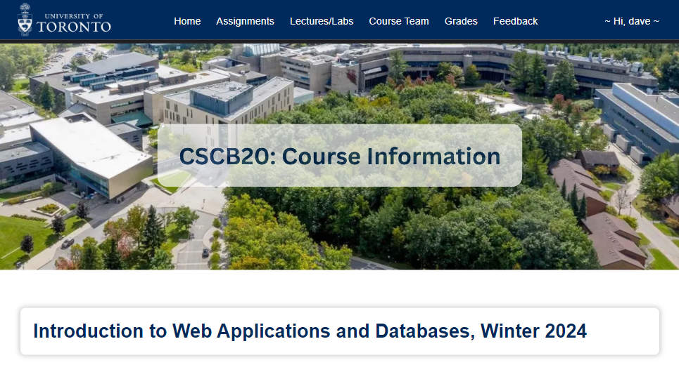
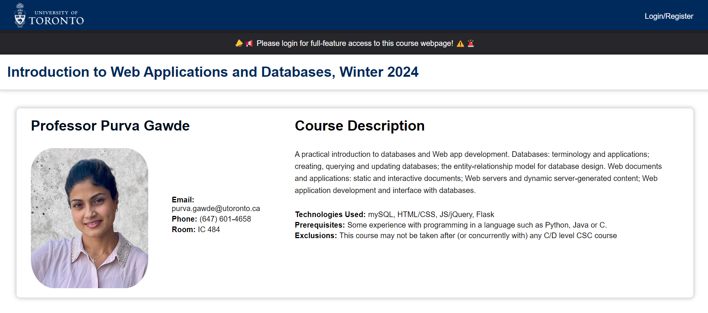
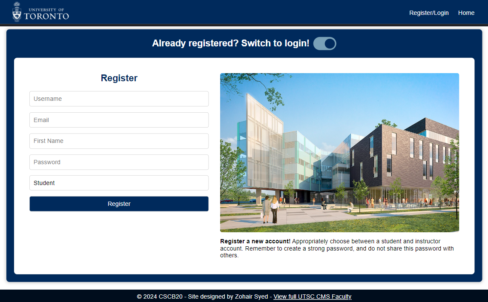
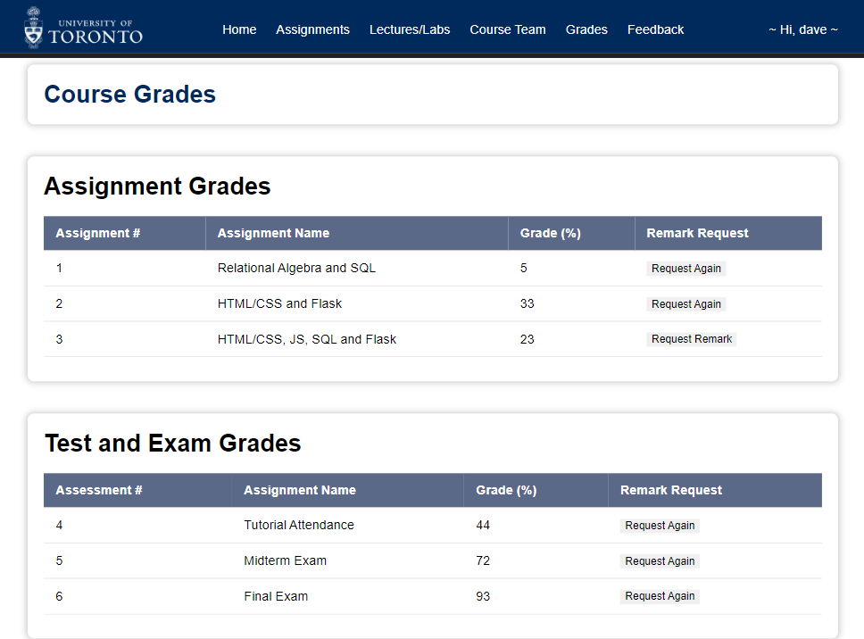

# CSCB20 Web Design and Databases Course Website!

This course webpage was designed as the final project for the UTSC course CSCB20, introduction to web design and databases. It is a full-stack application using HTML, CSS and JS for the frontend while using Python's Flask and SQLAlchemy as the backend. The app is comprised of many features and uses a serverless SQLite database to store all related course information.


## Notice

To view the webpage you must clone this repository. Open any terminal and run the command: (note this repository is different than the repository submitted for the assignment due to academic policies)

```
git clone https://github.com/zsspan/course-webpage
```
## Images

<p align="center">
  
  
</p>

<p align="center">
  
  
</p>

<p align="center">
  
</p>


